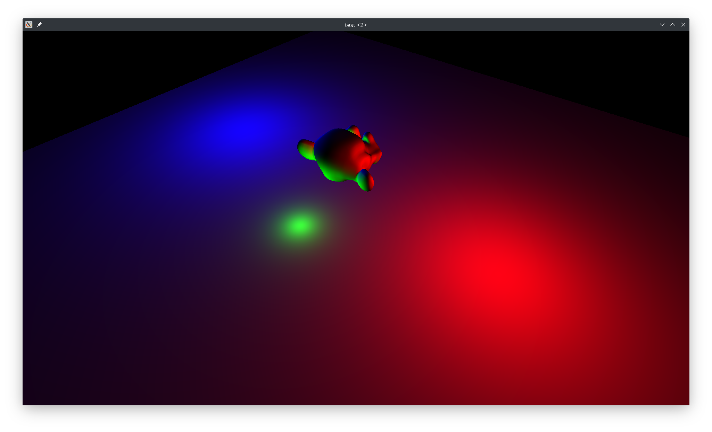
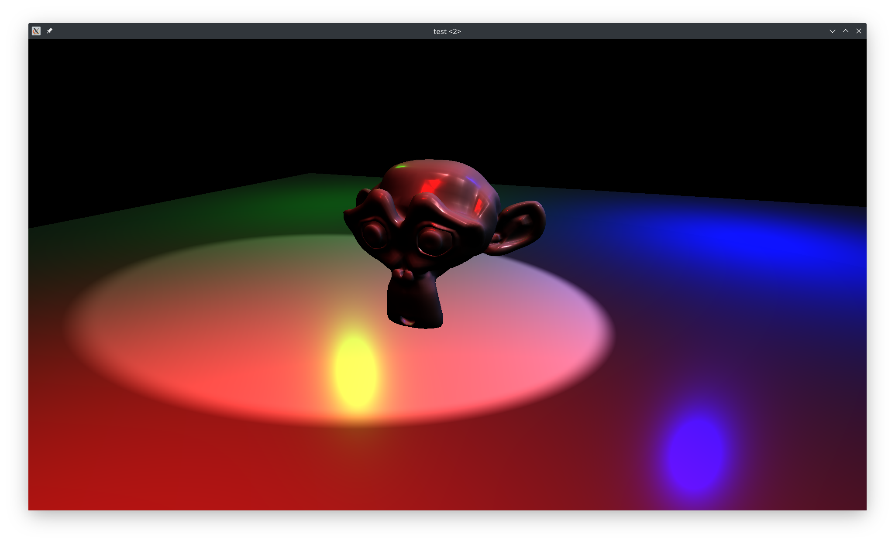
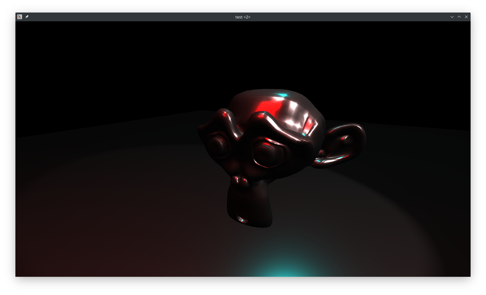

# albedo
This is an excercise OpenGL rendering engine project.

Okay, so I finaly got the idea in which direction this should be going. This thing here is strictly going to be the **renderer**. That means it's going to accept rendering tasks in (hopefully) rather DoD style and execute them. The ordering and selection of provided tasks should be performed by an external scene manager or whatever.

No resource management is done here as well, because it doesn't feel renderer-related at all. If anyone (I mostly mean myself) decides to use Albedo to render stuff, he should not be limited any conditions imposed by an arbitrary resource-manager that is completely unrelated to the rest of the application. I've tried to write a generic resource manager "good for every occasion" enough times to know that it's only going to be a pain in the ass later on.

The hard part here is, I suppose, merging somewhat conflicting apporaches to writing code. I'm trying to use modern C++ features as well as to keep it relatively data-oriented. If I don't faile miserably, we'll see what comes out of it.

As for the actual rendering, I'm hoping to implement at least basic PBR.

Some pics:

Going PBR:

